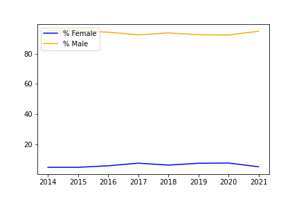
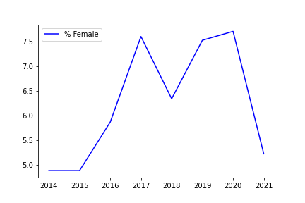
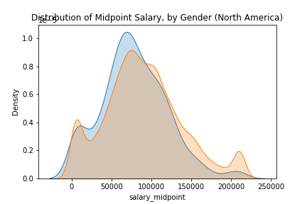
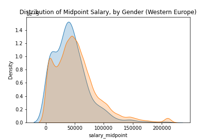
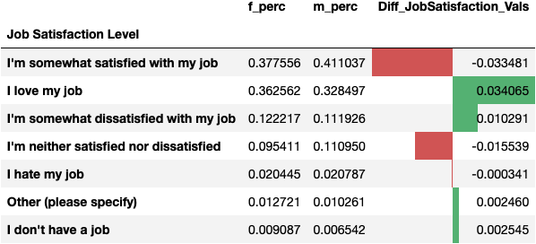
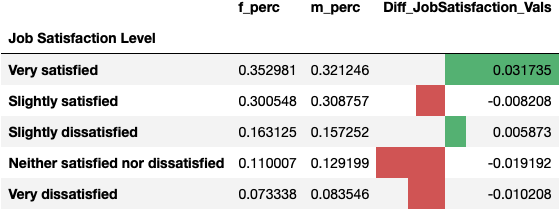

# Stack Overflow & Gender EDA

## Project Motivation
It was well known that women are underrepresented in tech and engineering roles. Over the past years, considerable efforts have been made to empower women to pursue careers in these fields. Using Stack Overflow survey annual datasets, I will conduct an exploratory data analysis to learn more about women and the technology industry. Specifically, I am interested in the following questions:

1. How has the gender representation in the stackoverflow survey response changed over the years?
2. What was the relationship between salary and gender in 2016?
3. What is the relationship between gender and job satisfaction?

## Summary of Results

* Women still consist of less than 10% of the Stack Overflow Developer Survey respondents. 
* Though the % of females have incrementally increased since 2014 there was a sudden decline from 2020 to 2021.
* The median midpoint salary in 2016 was lower than that of men in both Western Europe and North America.
* In these regions, there was a group of male outliars that significant outearned the others - an equivalent group was not observed among the female respondents. 
* The majority of both male and females reported being either very satified or satisfied with their jobs though both groups observed generally reported lower levels of satisfaction from 2016 to 2020. 

## Installations
**Python Version:** 3.8.12

**Packages:** pandas, matplotlib, seaborn, datagrame_image

## File Descriptions
**stack_overflow_gender_eda.ipynb** is the Jupyter notebook with the  the code for the EDA.
**stack_overflow_collection** is the folder in which I've collected the Stack Overflow survey response data from 2014-2021.

**Visualizations**

## How to Interact with the Project
After installing all the relevant packages, simply run *stack_overflow_gender_eda.ipynb*

## Licensing, Authors, Acknowledgements
Modified code for the job satisfaction dataframes from [here](https://github.com/udacity/DSND_Term2/blob/master/lessons/CRISP_DM/How%20To%20Break%20Into%20the%20Field%20-%20Solution%20.ipynb).

Data from the Stack Overflow Annual Developer Survey was downloaded [here](https://insights.stackoverflow.com/survey).

